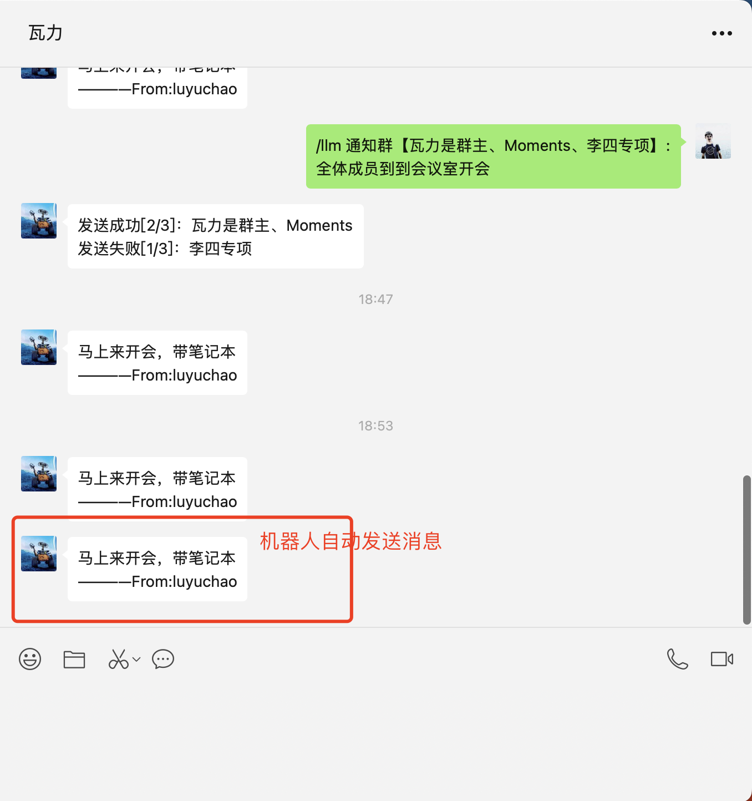

# Chat WeChat

## 简介

ChatGPT+WeChat的项目有很多，大部分项目聚焦的使用WeChat作为与ChatGPT聊天的对话窗口，包括本项目作者的另一个项目 [wechatgpt](https://github.com/atorber/wechatgpt)，Chat WeChat项目带来了一些新的探索，使用ChatGPT可以实现更多种与WeChat进行交互的可能性，他能够帮助实现更多有价值的应用。

本项目使用ChatGPT控制微信机器人执行各种命令，将WeChat打造成你的智能助理，开源项目wechaty+ [typechat](https://github.com/microsoft/TypeChat) 的结合，已实现以下功能：

- 使用自然语言给指定好友或群发消息（如果你是一个日常需要协调和安排各种不同的人或群的角色，这将非常有帮助）

- 定时任务（/llm 每天晚上10点提醒【大李】：该睡觉啦）

- ...

更多功能期待一起探索和贡献代码

## 快速开始

1. 检查nodejs环境，环境要求：[typechat](https://github.com/microsoft/TypeChat)仅支持nodejs18以上，不支持nodejs16

```
node -v
```

2. 重命名.env.example为.env,配置.env文件中相关信息

```.env
OPENAI_API_KEY=sk-xxxxxxxxxxxx # 你的openai api key
OPENAI_API_BASE_URL=https://api.openai.com # 你的openai请求地址
OPENAI_ENDPOINT=https://api.openai.com/v1/chat/completions # 你的openai接入点
OPENAI_MODEL=gpt-3.5-turbo # 使用的openai模型
ADMIN_ROOM_TOPIC=管理员专属群 # 管理群名称，在此群发消息时才会触发LLM指令，与ADMIN_WX_NAME至少配置一项
ADMIN_WX_NAME=李四 # 管理员微信昵称，管理员向发消息时才会触发LLM指令，一般是你另一个微信的昵称，与ADMIN_ROOM_TOPIC至少配置一项
```

> 国内可以购买到的openai api服务推荐 [传送门](https://www.yuque.com/atorber/oegota/rs4uk3geb4amurwb)

3. 安装依赖及运行程序

```
npm i
npm run start
```

4. 扫码登录后在管理员群内发消息或使用管理员微信向机器人发消息

指令格式“/+空格+指令内容”，控制指令示例：

```
/ 通知【超哥3、大师、大李】：马上来开会，带笔记本

/ 通知 张三：下午3点到会议室开会

/ 通知 张三、李四：下午3点到会议室开会

/ 通知群【瓦力是群主、Moments、全员群】:全体成员到到会议室开会

/ 通知群 Moments：全体员工下午1点到公司开会

/ 每天晚上10点提醒【大李】：该睡觉啦
```

> 将好友备注为实际姓名或不容易记混淆的名字，将会极大的提升准确率

## 效果

> 注意："/llm"开始的激活词已更新为"/"

在管理员群发送控制任务


自动识别并执行



定时任务（执行逻辑暂未实现）


## 迭代计划

- [ ] 增加黑白名单功能，可以将指定好友或群添加到白名单开启对应权限

- [ ] 待办清单/闪念胶囊，管理待办

- [ ] 消息查询，查询和指定好友、群的近期聊天内容

- [ ] 管理问答列表，向微信对话平台或QA Book添加问答内容

## 更新记录

### v0.1.0 (2023-8-6)

Init version

## 更多

推荐了解微软出品的探索性项目 [typechat](https://github.com/microsoft/TypeChat)
